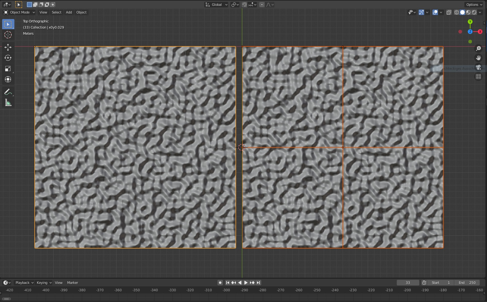
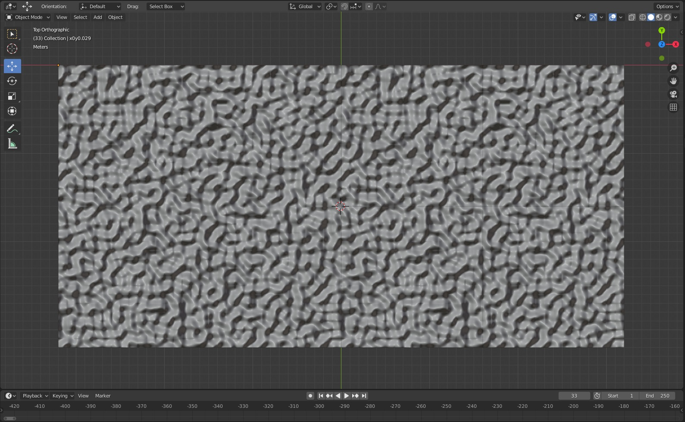

# Perlin Project

„Perlin Project“ ist eine Anwendung, die Noise Meshes auf Basis des Perlin Algorithmus erzeugt. Als Ausgabe werden sowohl Dateien im .ppm Format (Höhenkarte) und Dateien im .obj Format erzeugt.

## Benutzung

### Command Line Argumente

Alle Optionen erwarten einen numerischen Wert.

#### Mesh Größe

`-x, --size_x`

* Legt die Breite des Noise Meshes fest. Werte werden als Zweierpotenz 2n  angegeben.

`-y, --size_y`

* Legt die Länge des Noise Meshes fest. Werte werden als Zweierpotenz 2n  angegeben.

#### Aufteilung in mehrere Meshteile

Ein Noise Mesh kann durch Generierung mehrerer Meshteile und anschließender Zusammensetzung erzeugt werden. Jedes Meshteil wird von einem eigenen Thread generiert.

`-sx, --subsections_x`

* Gibt an, wie oft das Mesh vertikal geteilt wird.

`-sy, --subsections_y`

* Gibt an, wie oft das Mesh horizontal geteilt wird.

#### Parameter zur Generierung

`-s, --seed`

* Setzt den Seed für den Random Number Generator.

*Die folgenden Optionen werden für die Erzeugung der Meshteile auf einem einzelnen System nicht benötigt, diese sind für die verteilte Berechnung vorgesehen.*

`-d, --discard`

* Gibt die Anzahl der Meshteile an, deren Berechnung verworfen werden.

`-a, --amount`

* Die Anzahl der Meshteile, die vom System erzeugt werden sollen.

### Standardwerte

Wird die Anwendung ohne Argumente gestartet, werden folgende Optionen gesetzt:

`-x 128  -y 128  -sx 1  -sy 1  -s 2016  -d 0  -a 4`

## Beispiele mit Bildern des Outputs (3D Blender)

 <em>Linkes Objekt: Einzeln generiertes Noise Mesh - Rechtes Objekt: Vier generierte Meshteile, die zum gesamt Mesh zusammengesetzt wurden</em> 

Die beiden Objekte wurden in zwei verschiedenen Instanzen erzeugt:

* Linkes Objekt - Argumente: 	`-x 1024  -y 1024  -sx 1  -sy 1`
* Rechtes Objekt - Argumente:  `-x 1024  -y 1024  -sx 2  -sy 2`

Da der Seed bei beiden Objekten gleich ist, bedeutet das: Beide sind identisch!

Noise Meshes haben zudem noch die Eigenschaft, dass sie periodisch sind:

 <em>Beide Meshobjekte gehen stetig ineinander über</em> 

